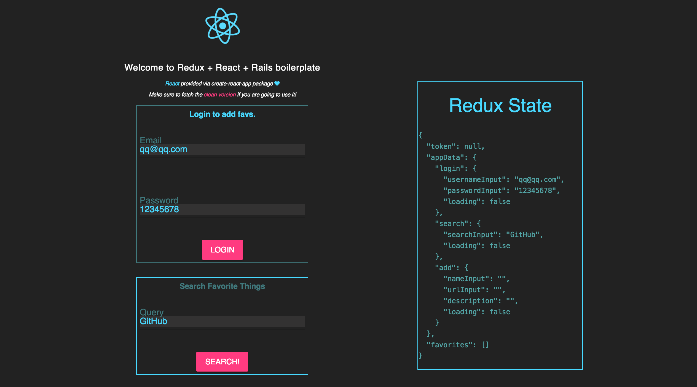

# Redux-React-Rails-Boilerplate
## https://redux-react-rails-boilerplate.herokuapp.com/ 
( free heroku dyno, give it some time to spin up)

* Redux
* ReduxThunk for async actions
* React
* Rails5
* Material Design Lite
* Bootstrap
* FontAwesome
* ReactToastr Notifications
Demo app(master) size compressed and minified: 580kb, 5 requests.

The master branch is semi-educational. Have no experience with this stack?
Follow the simple demo code. There are notifications and mouseovers
trying to explain what is going on as far as Redux containers and Redux
actions go. The clean_version branch should be used for starting projects. I
intentionally left out displaying form validations being returned from
the backend because there is enough going on already for simple boilerplate.




### Caviats
* Ruby/Rails/Bundler Setup - It's beyond the scope of this readme to 
help you with this, it can be something of a long process given your setup.
If you are on Windows, God help you. Here are some usefull links:
https://github.com/rbenv/rbenv https://github.com/bundler/bundler

* Router - This is not set up to work with the react-router. If you think
your design needs it, think again. If you still think it needs it,
see this gist (coming soon) on a hack you can do to have Rails
and React router play together.

* OAuth - Knock does not support multiple authentication  strategies out
of the box. Luckily, there has been discussion and attempts at this by
users of the gem. Have a look at https://github.com/nsarno/knock/issues/11
if you are interested in this. Please open a PR here if you do get it working
smoothly!

### Installation:

Do a search and replace on the entire project for 'ReduxReactRails' in
order to change the psql database and project name. 

##### Prod:
Change your production host to localhost also for now in /client/.env before you build.
```
bundle install
rails db:create
rails db:migrate
rails db:seed
cd client
npm install
npm run build
rails s
visit localhost:3000
```

###### Dev:
```
Tab1:
bundle install
rails db:create
rails db:migrate
rails db:seed
rails s
Tab2:
cd client
npm install
npm start
visit localhost:3001
```

### Contribute!
* Clone it
* Create your feature branch
* Commit your changes
* Push to the branch
* Create a new Pull Request
